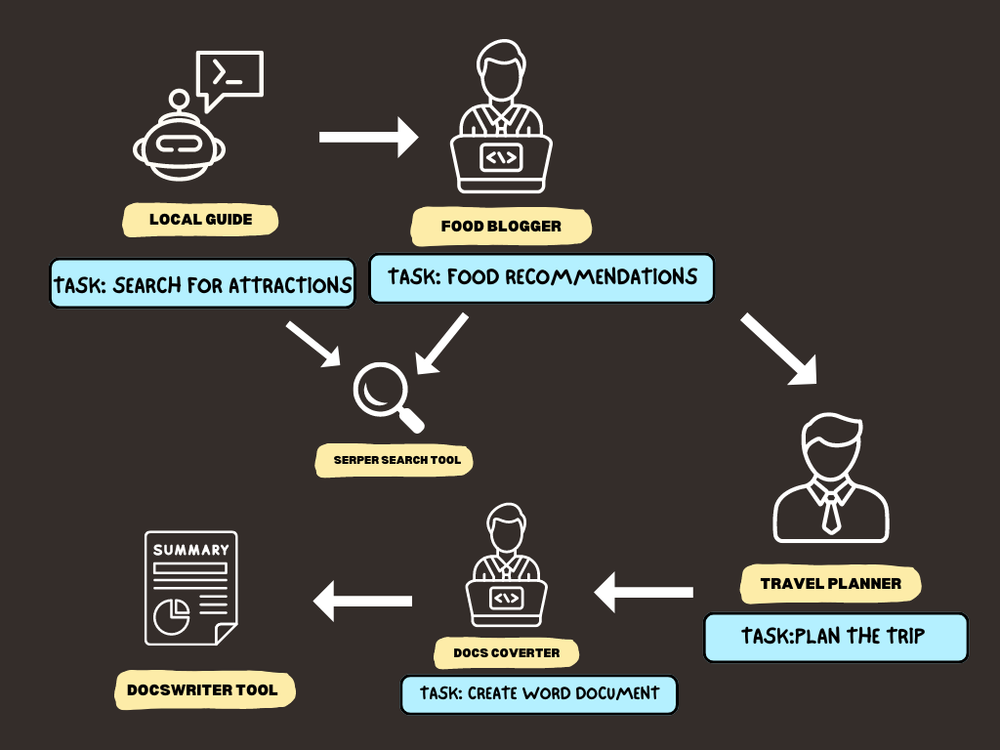

<div align = "center">
<h1>AI Crew Travel Recommendations</h1>
</div>

## Introduction
Imagine embarking on a journey where every step of your adventure is curated with precision, tailored to your preferences, and dynamically adjusted in real-time to ensure an unforgettable travel experience. This project will provide personalised travel recommendation based on the country, your interests or hobbies and the number of days. 

Built with CrewAI as an Agentic framework as well as FastAPI, it is able to generate your Travel Plan in Word Document in real-time. I tap on CrewAI framework which is built for orchestrating role-playing, autonomous AI Agents. CrewAI focus on empowering agents to work together seamlessly, tackling complex tasks with capabilities ranging from web search, data analysis to collaboration and delegating tasks among coworkers. 

### 1. Installation and Setup
- Clone the repository: 
```
git clone "https://github.com/keenlim/travel-crew.git"
cd travel-crew
```

- To run the application, you need to first create a virtual environment and install all dependencies and all required libraries. 
```
pip install virtualenv
python3.11 -m venv .venv
pip install -r requirements.txt
```

### 2. Setting up API Keys
- Create the .env file and populate:
```
OPENAI_API_KEY = "sk-xxx"
SERPER_API_KEY = "xxx"
```
- You might also need to export the OPENAI_API_KEY for macOS in your terminal: 
```
export OPENAI_API_KEY = "sk-xxx" 
```

### 3. Running the Application
- To start the API Application: 
```
uvicorn main:app --reload
```

### 4. Accessing the Application
- Open your browser and visit the following URL
```
http://127.0.0.1:8000/docs
```
Once you have accessed the URL, you will see the FastAPI Swagger UI that you would be able to perform a simple POST request. 

## API Endpoints
### 1. 'POST /travelplan/
#### Description
This endpoint accepts data input and returns an output message based on the provided data. 

#### Input
The JSON payload should have the following structure: 
```
{
  "country": "string",
  "interests": "string",
  "number_of_days": "string"
}
```
#### Parameters:
- country (type: string): Country that you would like to visit / receive Travel Recommendations of. 
- interests (type: string): Your personal interest / hobbies that would allow Agents to provide a better personalised travel recommendations. 
- number_of_days (type: string): Number of days for the trip you would like the Agents to plan for.

Example: 
```
{
  "country": "Japan, Tokyo",
  "interests": "Hiking, Nature, Shopping",
  "number_of_days": "7"
}
```

#### Response:
The response will be a JSON object containing the final output message from the crew. If the Crew is succesful, it will return a success message. 

Example: 
```
{
  "result": "Successfully converted the markdown file into a Word document. The full itinerary can be viewed in the saved file at the file path '../plan.docs'."
}
```

In addition, you will also be able to view the Travel Plan in markdown format at the file path '../plan.md' and the Word Document at the file path '../plan.docx'. 

#### Error Handling
The API will return appropriate error messages and status codes for different scenarios: 
- **400 Bad Request:** The request payload is malformed or missing required fields. 
- **404 Not Found:** The requested endpoint does not exist. 
- **500 Internal Server Error:** An unexpected error occurred on the server.


## Features

Design of the Crew

1. AI Agents will use the GPT-3.5-Turbo Model to curate a personalised travel recommendation for users. 
2. AI Agents will use the SERPER Search Tool to search for real-time information online. 
3. AI Agents will help to convert markdown format documents to Word Document for easy access. 

## Future Improvements
1. Add a Frontend to the Restful API Application. 
2. Fine tune the search by using Retrieval-Augmented Generation (RAG) techniques. 
3. Deploying the application to a cloud provider like AWS. 
4. Conducting usability testing with users to gather feedback and improve the application. 
5. Analyse user preference using historical data to allow AI Agents to tailor to their preference and provide a more personalised travel experience. 

## Closing Thoughts
While this simple API project will help in curating travel recommendations based on user's preferences, more can be improved to achieve better accuracy and creation of a user-friendly application. 